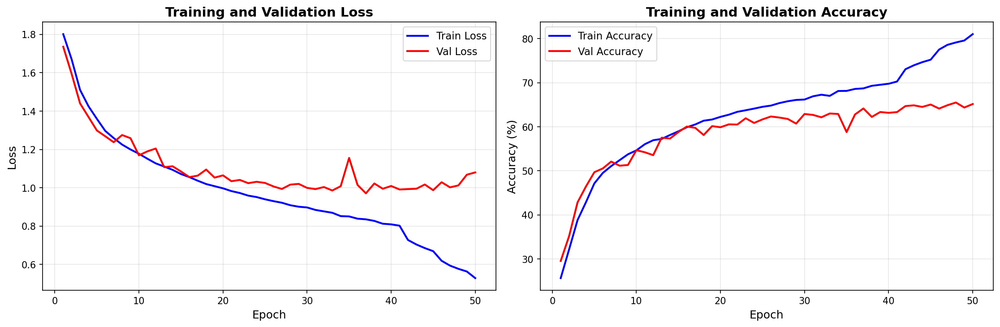

# 🎭 Real-Time Facial Emotion Recognition with ResNet50

<div align="center">

High-performance real-time facial emotion recognition system using ResNet50 architecture, trained on FER2013 dataset.

[](https://www.python.org/downloads/)
[](https://pytorch.org/)
[](https://opencv.org/)
[](https://opensource.org/licenses/MIT)

[Features](#-key-features) • [Installation](#-installation) • [Usage](#-usage) • [Performance](#-performance) • [Dataset](#-dataset)

</div>

---

## 🎥 Demo

<div align="center">
  <video src="https://github.com/user-attachments/assets/40519d55-06ec-432a-bed3-cc872b288833" width="300" controls></video>
  
  *Real-time emotion detection running at 30+ FPS*
</div>

---

## 📋 Overview

A production-ready system that identifies **7 distinct facial emotions** through webcam feeds in real-time. Built on custom **ResNet50 architecture** achieving **65.59% validation accuracy** on the [FER2013 dataset](https://www.kaggle.com/datasets/msambare/fer2013).

### ✨ Key Features

<table>
<tr>
<td width="50%">

🚀 **Real-time Processing**
- 30+ FPS on GPU
- Optimized inference pipeline
- FP16 precision support

⚡ **High Performance**
- 65.59% validation accuracy
- ~80% training accuracy
- Minimal latency

</td>
<td width="50%">

🎯 **Seven Emotions**
- Neutral • Happiness • Sadness
- Surprise • Fear • Disgust • Anger

🛠️ **Production Ready**
- Temporal smoothing
- Threaded capture
- MediaPipe face detection

</td>
</tr>
</table>

---

## 🏗️ Architecture

**Model:** Custom ResNet50 with Bottleneck blocks [3, 4, 6, 3]

```
Input (224×224×3)
    ↓
Conv2dSame(7×7) → BatchNorm → ReLU → MaxPool
    ↓
ResBlock Layer 1 (64 channels)
    ↓
ResBlock Layer 2 (128 channels)
    ↓
ResBlock Layer 3 (256 channels)
    ↓
ResBlock Layer 4 (512 channels)
    ↓
AdaptiveAvgPool → FC(2048→512) → FC(512→7) → Softmax
    ↓
Output (7 emotion classes)
```

### 🎓 Training Configuration

| Parameter | Value |
|-----------|-------|
| **Optimizer** | Adam (lr=0.001, weight_decay=0.0001) |
| **Scheduler** | ReduceLROnPlateau (factor=0.5, patience=3) |
| **Batch Size** | 64 |
| **Epochs** | 50 |
| **Augmentation** | Flip, Rotation (±15°), Brightness/Contrast (0.8-1.2x) |

---

## 📊 Performance

<div align="center">



**Training Progress Visualization**

</div>

### 📈 Metrics

| Metric | Value | Description |
|--------|-------|-------------|
| **🎯 Validation Accuracy** | **65.59%** | FER2013 test set |
| **📚 Training Accuracy** | **80.00%** | FER2013 train set |
| **⚡ Speed (GPU)** | **30+ FPS** | NVIDIA GPU (FP16) |
| **💻 Speed (CPU)** | **10-15 FPS** | Intel/AMD CPU |
| **📦 Model Size** | **90 MB** | PyTorch .pt format |
| **🔢 Parameters** | **~23.5M** | Trainable params |

---

## 📚 Dataset

### [FER2013 - Facial Expression Recognition](https://www.kaggle.com/datasets/msambare/fer2013)

<table>
<tr>
<td>

**Dataset Statistics:**
- 📊 Training: ~28,709 images
- ✅ Testing: ~3,589 images
- 🎭 Classes: 7 emotions
- 📐 Resolution: 48×48 → 224×224

</td>
<td>

**Emotion Distribution:**
- 😐 Neutral
- 😊 Happiness
- 😢 Sadness
- 😲 Surprise
- 😨 Fear
- 🤢 Disgust
- 😠 Anger

</td>
</tr>
</table>

> **Note:** Images are grayscale 48×48 pixels, upscaled to 224×224 RGB for training.

---

## 🚀 Installation

### Prerequisites

```
✓ Python 3.8+
✓ CUDA-compatible GPU (recommended)
✓ Webcam for real-time inference
```

### Quick Setup

**1️⃣ Clone repository**
```bash
git clone https://github.com/yourusername/FER2013-ResNet50-Emotion-Recognition.git
cd FER2013-ResNet50-Emotion-Recognition
```

**2️⃣ Install uv** (fast package manager)
```bash
# Windows
powershell -c "irm https://astral.sh/uv/install.ps1 | iex"

# macOS/Linux
curl -LsSf https://astral.sh/uv/install.sh | sh
```

**3️⃣ Create environment and install dependencies**
```bash
uv venv
source venv/bin/activate  # Windows: venv\Scripts\activate
uv pip install -r requirements.txt
```

**4️⃣ Add pre-trained model**

Place the trained model file in the `models/` directory:
```
models/FER_static_ResNet50_AffectNet.pt
```

> 💡 **Tip:** Model file size ~90MB. Available on request or train your own using the notebook.

---

## 💻 Usage

### 🎬 Real-Time Detection

Run the emotion recognition system:

```bash
python realtime_facial_analysis.py
```

**⌨️ Controls:** Press `q` to quit

**📺 Output:**
- ✅ Real-time video feed with emotion labels
- 📊 Confidence scores for each prediction
- 🎯 Face bounding boxes with tracking
- ⚡ FPS counter for performance monitoring

### 🧪 Training Custom Model

Open training notebook in Jupyter:

```bash
jupyter notebook model_trainign_resnet.ipynb
```

> **Contains:** Complete pipeline including data loading, model training, evaluation, and export.

---

## 📁 Project Structure

```
FER2013-ResNet50-Emotion-Recognition/
│
├── 📂 models/
│   ├── FER_static_ResNet50_AffectNet.pt    # Trained model weights
│   └── training_curves.png                 # Training visualization
│
├── 🐍 realtime_facial_analysis.py          # Real-time inference script
├── 📓 model_trainign_resnet.ipynb          # Training notebook (Colab/Jupyter)
├── 📋 requirements.txt                     # Python dependencies
├── 🚫 .gitignore                           # Git ignore rules
└── 📖 README.md                            # Documentation

```

---

## ⚙️ Technical Details

### 🖼️ Image Preprocessing

```python
1. Resize to 224×224 (INTER_NEAREST)
2. Convert BGR → RGB color space
3. Mean normalization: [R: 91.49, G: 103.88, B: 131.09]
4. Convert to PyTorch tensor (C×H×W)
```

### 🔧 Performance Optimizations

| Optimization | Description | Benefit |
|--------------|-------------|---------|
| **FP16 Precision** | Half-precision on GPU | 2x faster inference |
| **CuDNN Auto-tuning** | Optimal conv algorithms | 10-20% speedup |
| **Downscaled Detection** | 50% resolution for face detection | 50% faster detection |
| **Threaded Capture** | Non-blocking webcam stream | Eliminates I/O bottleneck |
| **Temporal Smoothing** | 10-frame moving average | Stable predictions |

**Result:** 30+ FPS on NVIDIA GPU • 10-15 FPS on CPU

---

## 📖 Citation

If you use this project in your research or applications, please cite:

```bibtex
@software{fer2013_resnet50,
  title={Real-Time Facial Emotion Recognition with ResNet50},
  author={Your Name},
  year={2024},
  url={https://github.com/yourusername/FER2013-ResNet50-Emotion-Recognition}
}
```

### Dataset Citation

```bibtex
@inproceedings{goodfellow2013challenges,
  title={Challenges in representation learning},
  author={Goodfellow, Ian J and others},
  booktitle={ICONIP},
  year={2013}
}
```

---

## 📜 License

MIT License - see [LICENSE](LICENSE) file for details.

---

## 🙏 Acknowledgments

- **FER2013 Dataset** - ICML 2013 Challenges in Representation Learning
- **ResNet Architecture** - He et al., "Deep Residual Learning for Image Recognition"
- **MediaPipe** - Google's ML solutions for face detection
- **PyTorch** - Facebook AI Research

---

<div align="center">

### ⭐ Star this repository if you find it helpful!

**Built with ❤️ using PyTorch and ResNet50**

[Report Bug](https://github.com/yourusername/FER2013-ResNet50-Emotion-Recognition/issues) • [Request Feature](https://github.com/yourusername/FER2013-ResNet50-Emotion-Recognition/issues)

</div>
